# System Architecture Diagrams

## 1. Overall System Architecture

## 2. Channel Creation Workflow

```mermaid
flowchart TD
    A[Admin Login] --> B[Select Merchants]
    B --> C[Select Beneficiaries]
    C --> D[Set Token Amount]
    D --> E[Calculate Distribution]
    E --> F[Create Channel]
    F --> G[Distribute Tokens]
    G --> H[Channel Active]
    
    E --> I[Total Tokens ÷ Beneficiaries]
    I --> J[Tokens per Beneficiary]
    J --> G
```

## 3. Token Distribution Flow

## 4. User Interaction Flow

## 5. Data Flow Architecture

## 6. Security Architecture

## 7. Deployment Architecture

## 8. Channel Lifecycle

## 9. Token Transaction Flow

## 10. System Components Overview

These diagrams provide a comprehensive visual representation of the Token Distribution Channel Management System, showing the architecture, workflows, and interactions between different components.
